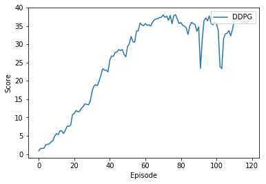

# Report

### Table of Contents

1. [Learning Algorithm](#learningAlgo)
2. [Training Results](#trainingResults)
3. [Future Work](#futureWork)


### Learning Algorithm <a name="learningAlgo"></a>

The DDPG based Actor-Critic agent used in this project consists of 3 fully connected layers with RELU activation layers and a batch normalization betweeen layer 1 and layer 2 for both Actor and Critic. Layers have a length of 400,300 and #actions nodes respectively. 

Using a policy-based approach, the agent (actor) learns how to act by directly estimating the optimal policy and maximizing reward through gradient ascent. Meanwhile, employing a value-based approach, the agent (critic) learns how to estimate the value (i.e., the future cumulative reward) of different state-action pairs. Actor-critic methods combine these two approaches in order to accelerate the learning process. Actor-critic agents are also more stable than value-based agents, while requiring fewer training samples than policy-based agents

The Agent uses Ornstein-Uhlenbeck process instead of Epsilon Greedy algorithm to define the parameters for exploration and exploitation as the environment is continuous rather than discrete. The hyperparameters of `mu=0`, `theta=0.15` and `sigma=0.2` was used for the Ornstein-Uhlenbeck process.

Experience replay allows the RL agent to learn from past experience. Each experience is stored in a replay buffer as the agent interacts with the environment. The replay buffer contains a collection of experience tuples with the state, action, reward, and next state (s, a, r, s') which the agent  samples from this buffer as part of the learning step. 

Complete code of the Q-Network and Replay can be found in dql_agent.py and model.py

Rest of the hyperparameters used in the code for training are shown below

```
BUFFER_SIZE = int(1e6)  # replay buffer size
BATCH_SIZE = 128        # minibatch size
GAMMA = 0.99            # discount factor
TAU = 1e-3              # for soft update of target parameters
LR_ACTOR = 1e-3         # learning rate of the actor 
LR_CRITIC = 1e-3        # learning rate of the critic
WEIGHT_DECAY = 0        # L2 weight decay
LEARN_TIMES = 25
LEARN_EVERY = 20
```

### Training Results <a name="trainingResults"></a>
The agent was able to achieve the given target with average score of 13 in 394 episodes. The learning curve and episodes are show below. The resulting model is saved as `checkpoint.pth`


```
Episode 108 Avg Score: 26.9
Episode 109 Avg Score: 27.1
Episode 110 Avg Score: 27.4
Episode 111 Avg Score: 27.8
Episode 112 Avg Score: 28.1
Episode 113 Avg Score: 28.4
Episode 114 Avg Score: 28.7
Episode 115 Avg Score: 29.0
Episode 116 Avg Score: 29.3
Episode 117 Avg Score: 29.6
Episode 118 Avg Score: 29.8
Episode 119 Avg Score: 30.1

SOLVED in 119 episodes!	With an average score: 30.1 over last 100 episodes
```



### Future Work <a name="futureWork"></a>

* Prioritized experience replay — Rather than selecting experience tuples randomly, we can select the entry from replay buffer in prioritized way. This can improve learning by increasing the probability that rare and important experience vectors are sampled and help the agent learn better.

* Distributed Distributional Deterministic Policy Gradients (D4PG) 